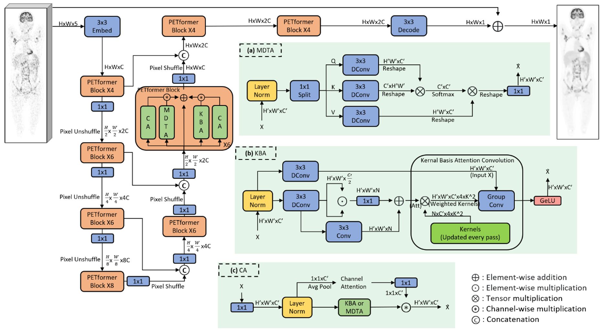
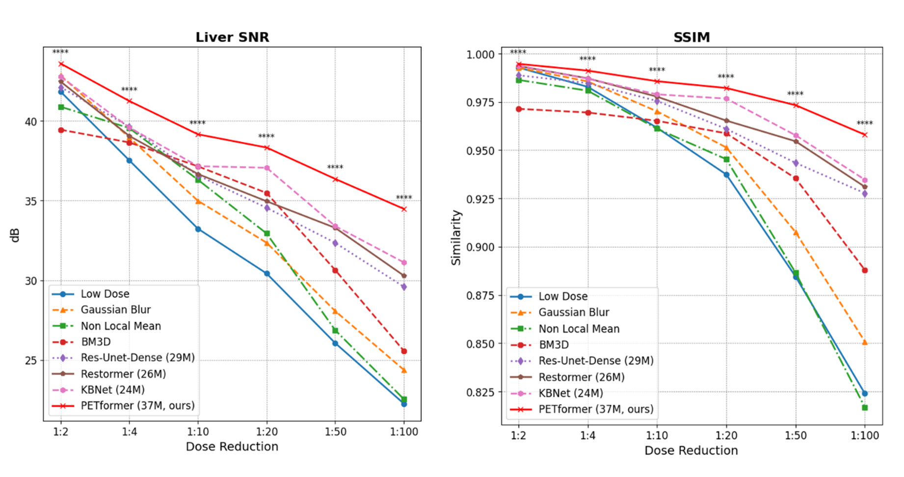

# PETformer: Ultra-Low-Dose Total-Body PET Imaging Without Structural Prior

## Overview

Positron Emission Tomography (PET) is essential for non-invasive imaging of metabolic processes in healthcare applications. However, the use of radiolabeled tracers exposes patients to ionizing radiation, raising concerns about carcinogenic potential, and warranting efforts to minimize doses without sacrificing diagnostic quality. In this work, we present a novel neural network architecture, PETformer, designed for denoising ultra-low-dose PET images as low as 2% dose without requiring structural priors such as CT or MRI. 

Key Highlights:
- Build on a U-Net backbone, PETformer consists of a series of multi-headed transposed attention (MDTA) blocks, kernel-basis attention (KBA) and channel attention (CA) block.
- Trained and validated on a dataset of 317 patients imaged on a total-body uEXPLORER PET/CT scanner.
- Achieved significant superiority over other established denoising algorithms across different dose-reduction factors.

For more details, please refer to the [paper (to be published)](google.com).

## Architecture

PETformer network architecture:


## Results



For more results, please refer to the [paper (to be published)](google.com).

## Pre-trained Weights

Datasets and model weights is not available at this time.

## Usage

To use the PETformer model:

```python
from petformer import PETformer

model = PETformer(...)
model.load_state_dict(torch.load('pretrained_weights.pt'))
model.eval()

# image tensor
input_image = torch.randn(...) # Replace with your image
denoised_image = model(input_image)
```

## Citation

If you found this work useful or used it in your research, please consider citing our paper:
(to be published)


## Contact

For questions or issues, please reach out to [yul055@ucsd.edu](mailto:yul055@ucsd.edu).


**Acknowledgment:** [KBNet](https://github.com/zhangyi-3/KBNet), [NAFNet](https://github.com/megvii-research/NAFNet), [Restormer](https://github.com/swz30/Restormer). 